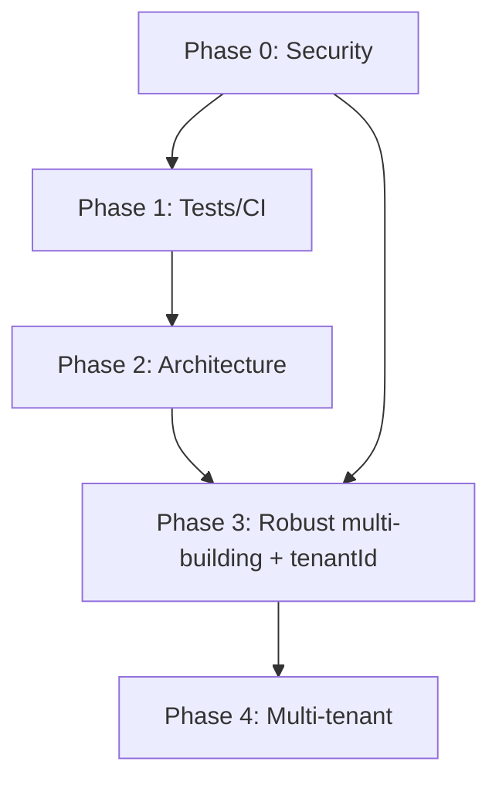

# Suggested roadmap

Recommended execution order, prioritizing risk and delivered value over “what is most interesting technically”.

> **Context:** this repository is a **non-production** v2 intended as the base for a multi-tenant platform serving multiple Propiedad Horizontal management companies. Phase 4 (multi-tenant) is part of the roadmap goal, not an optional branch.

## Phase 0 — Security (blocking, start now)

See [`01-security-plan.md`](01-security-plan.md).

- Remove `key/keystore.jks` from the repo and its history.
- `.gitignore` for credentials and keystore.
- Create and version minimum `firestore.rules` / `storage.rules`.
- Migrate role to Custom Claims.

*Why first:* active risk today, independent of any product or architecture decision.

## Phase 1 — Minimal test safety net

See [`04-quality-testing-plan.md`](04-quality-testing-plan.md).

- Replace the template test.
- Firestore rules tests (tied to Phase 0).
- Basic CI (`flutter analyze` + `flutter test`).

## Phase 2 — Architecture and deduplication

See [`02-architecture-plan.md`](02-architecture-plan.md) and [`architecture.md`](architecture.md).

- Typed models for all entities.
- Per-entity repositories.
- Extract shared widgets/mixins from add/edit screens.
- Adopt state manager (Riverpod/Provider) + `SessionController`.
- Centralized theming.

## Phase 3 — Robust multi-building (designed with `tenantId` already)

See [`03-multi-tenant-plan.md`](03-multi-tenant-plan.md) (Phase A).

- Buildings referenced by `buildingId`, not name.
- Data model with `tenantId` from the start (even if only one real tenant exists yet), to avoid a second migration.
- Active building selector centralized in `SessionController`.
- FCM topics based on stable IDs.
- Security rules validating building membership server-side.

## Phase 4 — Multi-tenant (project goal)

See [`03-multi-tenant-plan.md`](03-multi-tenant-plan.md) (Phase B).

- `tenants` collection, data isolation by `tenantId`, dynamic branding (replace `Globals`).
- Flavors or tenant resolution at login, depending on chosen distribution model.
- Onboarding of new management companies (create tenant, first superadmin, initial building).

## Phase dependencies

## Scope note

Phases 2 and 3 can partially overlap (e.g. introduce `buildingId` while creating typed models), but Phase 3/4 should not start without resolving Phase 0 — any data-model change without solid security rules amplifies current risk.
