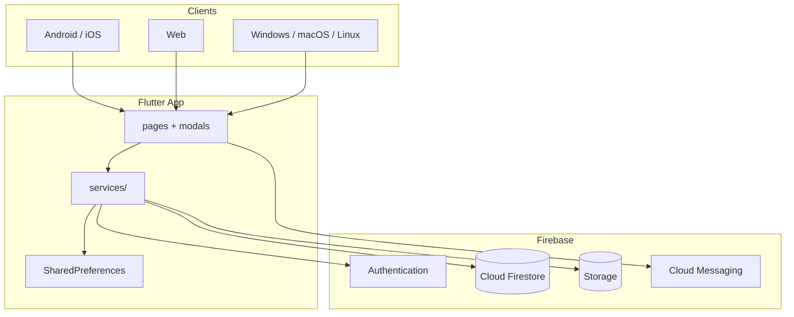
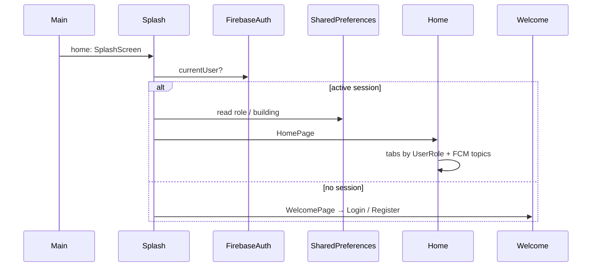
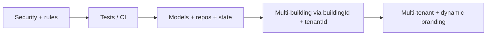

# Architecture — Administradores Diaz PH v2

Reference for humans and agents. Describes the **current** codebase and the **target** architecture toward a multi-tenant platform. Detailed plans live alongside this file in [`docs/`](./).

## 1. Context

| Aspect | Status |
|---|---|
| Product | Flutter app for Propiedad Horizontal (condo/building management) |
| Current client | Administradores Diaz PH SAS (Colombia) |
| Repo | `administradores-diaz-ph-v2` — **v2 pre-production** (production runs on a separate project) |
| Goal | Base for a **configurable multi-tenant** platform for multiple property-management companies |
| Backend | Firebase (Auth, Firestore, Storage, FCM) |

Today there is **multi-building** support (several buildings under one company). There is **no** multi-tenancy (separate companies with isolated data and branding).

## 2. System view (current)



No Cloud Functions are versioned in this repo. Sensitive authorization depends on the client plus whatever is configured in the Firebase console (security rules are **not** versioned here).

## 3. `lib/` structure

Organization is **by file type**, not by feature. There is no formal Clean Architecture / MVC / MVVM.

```
lib/
├── main.dart                 # Entry: Firebase init + MaterialApp → SplashScreen
├── global_variables.dart     # Hardcoded branding (Globals) — single-tenant coupling
├── splash_screen.dart / welcome_page.dart / login_page.dart / register_page.dart
├── home_page.dart            # Shell with role-based BottomNavigationBar
├── handlers/                 # Platform permissions (e.g. Android alarms)
├── models/                   # Only News + UserRole are typed
├── modals/                   # Full-screen CRUD screens (misleading historical name)
├── pages/                    # Shell tabs: news, dashboard, zones, messages, settings
├── services/                 # Auth, generic Firestore, PDF, SharedPreferences, platform
└── utils/                    # Shared helpers
```

> **`lib/modals/`**: not dialogs. These are `StatefulWidget` + `Scaffold` list/create/edit flows. The architecture plan proposes renaming to `screens/` or `features/<entity>/`.

### De facto layers

| Layer | Location | Actual responsibility |
|---|---|---|
| UI | `pages/`, `modals/`, auth pages | Widgets + form validation + direct Firestore queries |
| Services | `services/` | Firebase / prefs / PDF wrappers; no interfaces or DI |
| Models | `models/` | Incomplete typing; most entities are `Map<String, dynamic>` |
| Config | `global_variables.dart` | Static company identity |

There is **no** domain layer, per-entity repositories, or global state manager (Provider/Riverpod/Bloc). Everything uses `StatefulWidget` + `setState()`.

## 4. Startup and navigation flow



`HomePage` builds the bottom nav by role (`admin` / `superadmin` / `user`) and subscribes to FCM topics derived from the building **name**.

## 5. Roles and session

Defined in [`lib/models/user_role.dart`](../lib/models/user_role.dart):

| Dart enum | Typical Firestore value | Scope |
|---|---|---|
| `user` | `CLIENTE` | One building |
| `admin` | `ADMINISTRADOR` | List of buildings |
| `superadmin` | `SUPERADMINISTRADOR` | No building filter |

Current (fragile) pattern:

1. On login, role, `userId`, and building(s) are stored in **SharedPreferences** (plaintext).
2. `AuthService.getCurrentUserRole()` reads the role from prefs — **not** from Custom Claims, and does not revalidate against Firestore on each sensitive operation.
3. Most screens re-read prefs and filter with `where('edificio', ...)`.

This repeats across dashboard, news, zones, clients, complaints, votings, visits, calendar, bills, etc.

## 6. Firestore data model (current)

Collections used in code (literal names):

| Collection | Use |
|---|---|
| `users` | Residents and admins; messaging / user sub-data |
| `buildings` | Buildings / complexes |
| `news` | News feed |
| `dashboard` | Announcements / bulletin board |
| `zonas` | Common areas; subcollection `events` = bookings |
| `visits` | Visitor registration (+ PDF in Storage) |
| `bills` | Invoices / fees |
| `complaints` | Complaints (PQR) |
| `votings` | Polls / voting |

Key relationships:

- Buildings referenced by **name (`String`)**, not document ID → brittle on rename.
- No `tenantId` / `companyId` on documents.
- Storage paths like `{collection}/{objectId}/{file}` or PDF folders; no tenant partition.

FCM topics: `news_{normalized_building_name}` (spaces → `_`, lower case).

## 7. Services

| Service | Role |
|---|---|
| `AuthService` | Login/register/logout; role from prefs |
| `FirestoreService` | Generic `Map` CRUD + Storage upload + zone bookings |
| `SharedPreferencesService` | Local cache + FCM logic in `clearPrefs` (low cohesion) |
| `PdfService` | Visit PDFs; header from `Globals` |
| `PlatformService` | Mobile/iOS/web detection |

Many screens **bypass** `FirestoreService` and call `FirebaseFirestore.instance.collection(...)` directly.

## 8. Branding and single-tenant coupling

[`lib/global_variables.dart`](../lib/global_variables.dart) hardcodes Administradores Diaz PH name, slogan, address, phone, and email. The logo in assets is also hardcoded. Used on welcome and PDFs.

**Implication:** another property-management company requires source changes and a rebuild. Replacing this with remote per-tenant config is the core of multi-tenant Phase B ([`03-multi-tenant-plan.md`](03-multi-tenant-plan.md)).

## 9. Security (active debt)

Summary; detail in [`01-security-plan.md`](01-security-plan.md):

- No versioned `firestore.rules` / `storage.rules` / `firebase.json` in the repo.
- Role authorization mainly on the client (prefs).
- Keystore (`key/keystore.jks`) and Firebase configs exist in the working tree; root `.gitignore` does **not** exclude `key/`, `*.jks`, or Firebase config files.
- Local session without `flutter_secure_storage`.

New data-model or feature work **must not widen** this surface without advancing the security plan.

## 10. Target architecture

Roadmap order ([`05-roadmap.md`](05-roadmap.md)):



### Technical target (Phases 2–4)

```
lib/
├── features/<entity>/     # model, repository, screens (or screens/ + repositories/)
├── core/
│   ├── session/           # SessionController / providers (Riverpod recommended)
│   ├── theme/             # ThemeData; colors from tenant config
│   └── errors/            # AppException, etc.
├── services/              # Platform adapters only (FCM, secure storage)
└── ...
```

Target principles:

1. **Typed models** for Building, Client, Visit, Bill, Complaint, Voting, Zone, Announce, Tenant.
2. **Per-entity repositories** — encapsulate `buildingId` / `tenantId` filters; UI does not talk raw Firestore.
3. **Single session source** — user, role, buildings, active building, tenant config.
4. **Stable IDs** — `buildingId` (and `tenantId`) instead of name strings; FCM by ID.
5. **Server-side rules** — Custom Claims (`rol`, `tenantId`) validated in `firestore.rules`.
6. **Dynamic branding** — remove static `Globals`; load `tenants/{tenantId}`.

Design with `tenantId` now even if only the Diaz PH tenant exists, to avoid a later migration.

## 11. Decisions new changes must respect

1. Do not add more role/building reads from prefs in new screens; if touching session, move toward a central controller.
2. Do not hardcode more brand data in widgets; use `Globals` only if unavoidable and document the debt, or read from one place.
3. Prefer typed models when introducing entities or local refactors.
4. Do not commit secrets/keystores or weaken `.gitignore`.
5. Multi-building features must filter by building; when typing, prefer ID over name.
6. Tests: almost no real coverage; when extracting pure logic or repos, add unit tests.

## 12. Documentation map

| Document | Content |
|---|---|
| [`../AGENTS.md`](../AGENTS.md) | Operating instructions for AI agents |
| [`ai/README.md`](ai/README.md) | Index of agent-oriented docs |
| [`00-current-state-analysis.md`](00-current-state-analysis.md) | Detailed diagnosis |
| [`01-security-plan.md`](01-security-plan.md) | Security remediation |
| [`02-architecture-plan.md`](02-architecture-plan.md) | Code refactor plan |
| [`03-multi-tenant-plan.md`](03-multi-tenant-plan.md) | Multi-building + multi-tenant |
| [`04-quality-testing-plan.md`](04-quality-testing-plan.md) | Testing and CI |
| [`05-roadmap.md`](05-roadmap.md) | Phases and dependencies |
